# 完蛋！我被好想法包围了！

### 基于 AI 的学生创意项目孵化系统

> _"拥有好想法的最佳方式，是拥有很多想法。"_ — 莱纳斯·鲍林

---

## 摘要

**"完蛋！我被好想法包围了！"** 是一个 AI 增强的学习环境，旨在引导学生从最初的创意火花走向可执行的项目计划。

本应用基于成熟的学习科学框架构建——包括 **维果茨基的最近发展区 (ZPD)**、**逆向设计** 和 **自我决定理论 (SDT)**——填补了教育中的一个关键空白：帮助学生克服创意项目早期阶段的迷茫与焦虑。

---

## 问题：创意项目中的学生困境

研究表明，学生在开放式创意任务的**起步阶段**最为挣扎：

> "学生常常经历'空白页综合症'——一种认知过载的形式，无限的创作可能性导致决策瘫痪，而非生产性的创意生成。"
> — Kapur, M. (2016). _Examining Productive Failure in Learning_

传统教育方法要么：

- **过度结构化**（僵化的模板扼杀创造力）
- **缺乏引导**（仅说一句"发挥创意！"却没有脚手架支持）

这两种方法都忽视了一个事实：创意思维是一种**可学习的技能**，需要适当的支撑。

---

## 我们的解决方案：两阶段脚手架式创意引导

本应用引导学生经历两个互补阶段：

### Stage 1: 灵感孵化

**目标**：将模糊兴趣转化为具体项目概念

通过 AI 生成的"任务盲盒"，学生可以探索多种项目可能性，而无需过早承诺。这一阶段拥抱**发散性思维**，同时提供恰到好处的结构以防止过载。

**核心功能**：

- 元认知热身（能量检测、帮助偏好、挑战水平）
- 基于学生当前状态匹配的 AI 策划项目提示
- 低风险的"微试探"，减少对承诺的恐惧
- 个性化"魔改"选项，保障学生自主权

### Stage 2: 灵感模拟

**目标**：将项目愿景解构为可执行的依赖关系图

采用**逆向设计**方法论，学生从期望的最终结果倒推，识别必要的前置条件、潜在障碍和具体的第一步。

**核心功能**：

- 可视化逻辑地图（节点代表里程碑、任务和验证点）
- AI 引导式提问，模拟专家导师指导
- 渐进式复杂度展开（从骨架开始，逐步添加细节）
- 可导出的项目蓝图（PNG/PDF/JSON）

---

## 理论基础

### 1. 最近发展区 (维果茨基, 1978)

应用根据学生自报状态动态调整脚手架：

| 学生状态 | 脚手架级别               | 示例                   |
| -------- | ------------------------ | ---------------------- |
| 低能量   | 最大支持（"轻松档"模式） | 预策划任务包，仅需点击 |
| 中等     | 平衡引导（"半自助"模式） | AI 建议 + 学生修改     |
| 高自信   | 最小干预（"老手"模式）   | 直接生成项目卡片       |

这确保学生获得**在其 ZPD 范围内**的支持——足够有挑战性以促进成长，又足够易达以避免挫败。

### 2. 逆向设计 (Wiggins & McTighe, 2005)

Stage 2 实现了"理解为先设计"的核心原则：

```
第一步：定义期望的最终状态（"完成"标准）
第二步：逆向推导识别前置条件
第三步：规划解决每个前置条件的学习/创作活动
```

这种方法对创意项目尤其有效，因为学生往往难以将宏大愿景拆解为可管理的小块。

### 3. 自我决定理论 (Deci & Ryan, 2000)

本应用支持 SDT 识别的三种心理需求：

| 需求       | 应用如何支持                                         |
| ---------- | ---------------------------------------------------- |
| **自主性** | 学生选择项目方向、修改 AI 建议、控制节奏             |
| **胜任感** | 渐进式技能指标、每个里程碑的成功标准、可视化进度追踪 |
| **归属感** | AI "教练"提供支持性、非评判性反馈；可分享的项目蓝图  |

### 4. 有益困难 (Bjork, 1994)

应用通过以下方式引入生产性挣扎：

- **基于约束的提示**：每张任务卡包含一个创意约束，强制原创思维
- **假设验证**：逻辑模拟器要求学生阐明并测试隐藏假设
- **迭代精修**：初始项目骨架故意不完整，需要学生补充

---

## 目标用户

本应用面向：

- **初高中学生**（6-12 年级）进行创意项目
- **自主学习者**探索兴趣项目
- **教育工作者**寻找开放式作业的脚手架工具
- **创客空间和创新实验室**支持学生创意

---

## 循证设计决策

| 设计选择                    | 理论依据                                                   |
| --------------------------- | ---------------------------------------------------------- |
| **趣味语言和表情符号**      | 减少与创意任务相关的焦虑 (Fredrickson, 2001)               |
| **"任务盲盒"隐喻**          | 游戏化元素增加内在动机 (Deterding et al., 2011)            |
| **可视化逻辑地图**          | 双编码理论认为视觉+语言表征增强理解 (Paivio, 1986)         |
| **AI 作为"教练"而非"专家"** | 将 AI 定位为支持工具，维护学生自主权 (Luckin et al., 2016) |
| **可导出的产出物**          | 有形产出增加成就感并便于分享                               |

---

## 与现有工具对比

| 工具                        | 方法                 | 局限                               |
| --------------------------- | -------------------- | ---------------------------------- |
| 思维导图软件                | 自由头脑风暴         | 无引导；无法解决"我该画什么"的问题 |
| 项目管理工具                | 任务追踪             | 假设项目已经定义好了               |
| AI 聊天机器人（如 ChatGPT） | 开放式对话           | 无结构；可能让初学者不知所措       |
| **本应用**                  | **结构化创意流水线** | **从灵感到执行的引导之旅**         |

---

## 教学工作流

```mermaid
flowchart LR
    subgraph Stage1["Stage 1: 发散阶段"]
        A[💭 热身] --> B[🎚️ 模式选择]
        B --> C[🎨 风格/氛围]
        C --> D[📦 交付类型]
        D --> E[🎁 AI 任务盲盒]
        E --> F[✨ 个人魔改]
        F --> G[📋 项目卡片]
    end

    subgraph Stage2["Stage 2: 收敛阶段"]
        H[🎯 定义完成状态] --> I[⬅️ 逆向推理]
        I --> J[🔗 识别依赖]
        J --> K[⚠️ 浮现假设]
        K --> L[✅ 验证逻辑]
        L --> M[🗺️ 逻辑地图]
    end

    G --> H
    M --> N[🚀 准备执行]
```



---

## 使用指南

### 给教育工作者

1. **克隆并运行应用**（见技术 README）
2. **将工具介绍为**"创意项目启动器"
3. **让学生独立探索 Stage 1**（10-15 分钟）
4. **围绕逻辑地图有效性开展 Stage 2 讨论**
5. **使用导出的产出物**作为项目规划文档

### 给学生

1. **在热身环节保持诚实** — AI 会适应你的当前状态
2. **不要过度思考任务卡选择** — 随时可以重新开始
3. **拥抱"魔改"步骤** — 你的个人风格让项目独一无二
4. **相信逆向设计过程** — 即使一开始感觉不直观

---

## 未来方向

- **协作模式**：多名学生共同构建逻辑地图
- **教师仪表板**：学生创意模式的分析
- **课程整合**：与学习标准对齐的预加载任务包
- **纵向追踪**：连接项目蓝图与最终成果

---

## 参考文献

- Bjork, R. A. (1994). Memory and metamemory considerations in the training of human beings. In J. Metcalfe & A. Shimamura (Eds.), _Metacognition: Knowing about knowing_ (pp. 185–205).
- Deci, E. L., & Ryan, R. M. (2000). The "what" and "why" of goal pursuits: Human needs and the self-determination of behavior. _Psychological Inquiry_, 11(4), 227–268.
- Deterding, S., Dixon, D., Khaled, R., & Nacke, L. (2011). From game design elements to gamefulness. _Proceedings of MindTrek_.
- Fredrickson, B. L. (2001). The role of positive emotions in positive psychology. _American Psychologist_, 56(3), 218–226.
- Kapur, M. (2016). Examining productive failure, productive success, and restudied conditions. _Instructional Science_, 44(4), 273–286.
- Luckin, R., Holmes, W., Griffiths, M., & Forcier, L. B. (2016). _Intelligence Unleashed: An argument for AI in Education_. Pearson.
- Paivio, A. (1986). _Mental representations: A dual coding approach_. Oxford University Press.
- Vygotsky, L. S. (1978). _Mind in society: The development of higher psychological processes_. Harvard University Press.
- Wiggins, G., & McTighe, J. (2005). _Understanding by Design_ (2nd ed.). ASCD.

---

## 贡献指南

欢迎教育工作者、学习科学研究者和开发者贡献代码与想法。

---

## 开源协议

MIT 协议 — 教育和非商业用途免费使用。

---

<p align="center">
  <em>为那些有大想法但需要帮助实现的学生用心打造 ❤️</em>
</p>
